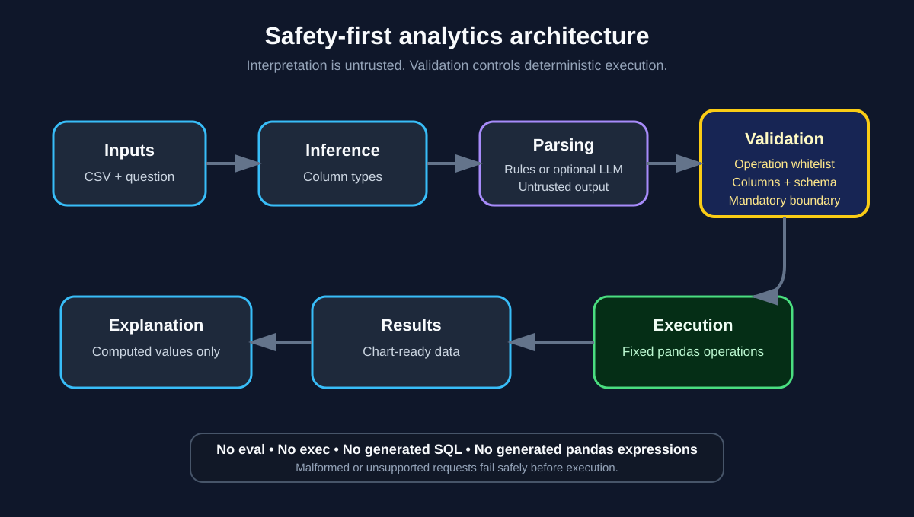

# Architecture

## Design objective

The application provides natural-language access to tabular business data without granting a language model authority to execute arbitrary code.

The central architectural decision is to separate **interpretation** from **execution**:

1. A user provides a CSV file and asks a question.
2. Dataset columns are inspected and typed.
3. A rule-based parser or optional provider parser proposes a structured intent.
4. Provider output is decoded through a strict untrusted-JSON boundary.
5. Application code validates the resulting `QuerySpec` against a fixed operation whitelist and the real dataset schema.
6. A deterministic pandas executor performs the calculation.
7. The result is converted into chart-ready data and a grounded written explanation.

## Trust boundaries

### Untrusted inputs

- uploaded filenames and CSV contents
- column names and cell values
- natural-language questions
- optional provider responses

All of these inputs are treated as data, never as executable instructions.

### Provider-response boundary

`src/insight/parser_llm.py` accepts only a JSON object containing supported `QuerySpec` fields. Empty output, malformed JSON, arrays, unknown fields, missing operations, and invalid field types are rejected. A successfully decoded object is still untrusted and must pass application-side validation.

### Mandatory application boundary

`src/insight/query_spec.py` defines the contract that crosses into execution. A request is executable only after validation confirms:

- the operation is supported
- referenced columns exist
- required fields are present
- numeric operations use a numeric value column
- trend operations use a date-classified column
- grouping and filtering use known columns

Every parser path reaches this boundary through `src/insight/pipeline.py`.

### Deterministic execution

`src/insight/executor.py` maps validated operations to explicit pandas calls. It does not execute generated source code, SQL, or expression strings.

The executor also rejects valid query intent when the dataset cannot produce a meaningful result, including:

- empty filtered datasets for non-count operations
- null-only numeric measures
- invalid or empty trend dates
- empty grouped/trend outputs
- NaN or infinite analytical results

## Component responsibilities

| Component | Responsibility |
|---|---|
| `data.py` | Load CSV data and infer useful column types |
| `parser_rule_based.py` | Translate common question patterns without an external model |
| `parser_llm.py` | Call optional providers and strictly decode untrusted responses |
| `query_spec.py` | Validate the query contract and enforce the safety boundary |
| `executor.py` | Perform deterministic analytics and reject unusable results |
| `explain.py` | Produce a narrative based on actual computed values |
| `pipeline.py` | Coordinate parsing, fallback, validation, execution, and explanation |
| `streamlit_app/app.py` | Provide the interactive interface and safe user-facing errors |

## Failure handling

Provider failures are logged through structured application logging and fall back to the rule-based parser. Provider exception details are not returned in the user-facing result.

Malformed CSVs, empty files, unsupported requests, and execution failures are converted into concise Streamlit messages. Unexpected internal failures should not be exposed directly to end users.

## Security properties

The architecture is designed so that:

- a provider cannot select an operation outside the whitelist successfully
- a provider cannot reference nonexistent or incompatible columns successfully
- CSV cell text cannot become executable instructions
- malformed provider output fails before `QuerySpec` validation
- failed validation stops execution
- explanations are generated from computed results rather than model memory
- provider failure fallback still uses the same validation boundary

These properties are covered by behavioural, schema, malformed-response, provider-fallback, executor edge-case, and injection-resistance tests.

## Deployment boundary

The included Docker image is a local demonstration image. It runs as a non-root user and excludes environment files and private local configuration. It is not a complete production reference architecture.

A commercial multi-user deployment would require separate identity, authorisation, tenant isolation, secret storage, monitoring, retention, compliance, backup, and incident-response controls. Those controls belong in a separate private production repository.

## Trade-offs

The constrained design intentionally sacrifices arbitrary analytical flexibility for auditability, testability, deterministic behaviour, and a smaller attack surface. Queries requiring joins, custom formulas, forecasting, or unrestricted SQL are rejected or remain out of scope.

## Future evolution

New analytical capabilities should be added as explicit typed operations with:

1. a schema update
2. validation rules
3. deterministic executor logic
4. positive and negative tests
5. security review
6. user-facing documentation
